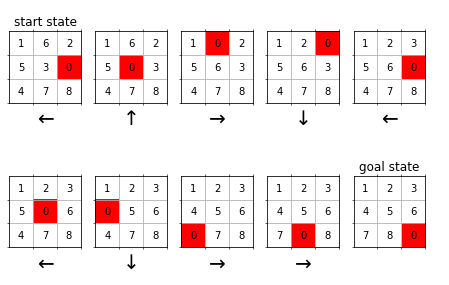

# 8 Puzzle Solver
Python implementations of different algorithms to solve the 8 Puzzle problem, along with a comparison between them. The 8 Puzzle is a sliding puzzle consisting of a 3x3 grid with eight numbered (1 to 8) tiles and one empty space (zero).

## Algorithms Implemented

The following algorithms have been implemented to solve the 8 Puzzle problem:

1. **A* Search (Astar)**
(Heuristic function = manhattan distance)
2. **Uniform Cost Search (UCS)** 
3. **Breadth-First Search (BFS)**
4. **Depth-First Search (DFS)**
5. **Iterative Deepening Depth-First Search (IDS)**